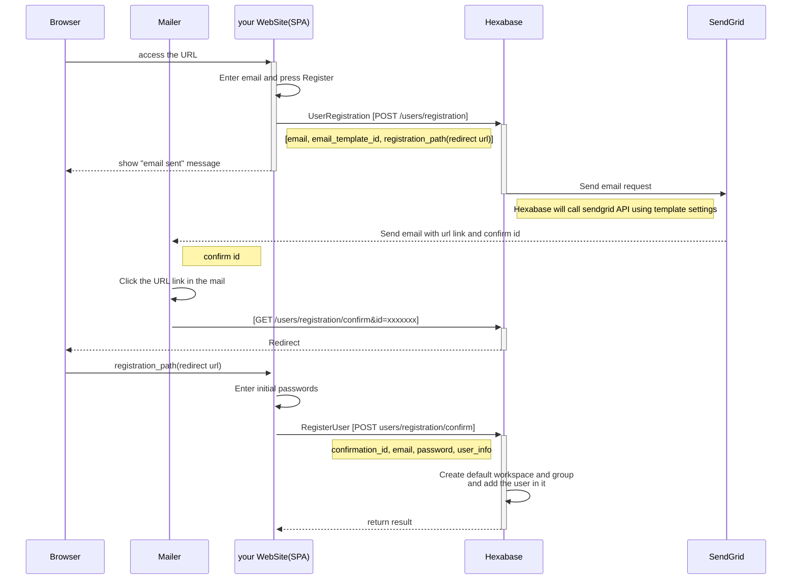

# UserRegistration API
新規ユーザと最初ワークスペースを作成する

## Overview

システムへはじめてのユーザを登録するためのフローと利用APIを説明します。
メールを送信するために、SendGridサービスの利用が必須です。

## Prerequisites

Hexabase社へEmail送信用のSendGridのAPI_KEY、テンプレートIDを連絡し、email_template_idの発行を受けます。
(Optional) Hexabaseデフォルトのメールテンプレートを利用すればemail_template_idの発行をしなくても開発を進めることができます。

## API

| No | API Name | API名 | Method | URI | 目的 | version | 画面ID\(display\_id\)への対応 |
| :---: | :--- | :--- | :--- | :--- | :--- | :--- | :--- |
| 53 | [UserRegistration](UserRegistration.md) | 初回ユーザー登録 | POST | /api/v0/users/registration | ユーザーの初期登録用リクエスト | v0 | - |
| 55 | [RegisterUser](RegisterUser.md) | ユーザー初期登録 | POST | /api/v0/users/registration/confirm | ユーザーの初期登録、パスワード登録 | v0 | - |

## Sequence Diagram

このページを参照するためには、Webブラウザへ[Mermaid Extension](https://chrome.google.com/webstore/detail/github-%2B-mermaid/goiiopgdnkogdbjmncgedmgpoajilohe/related) をインストールしてください

