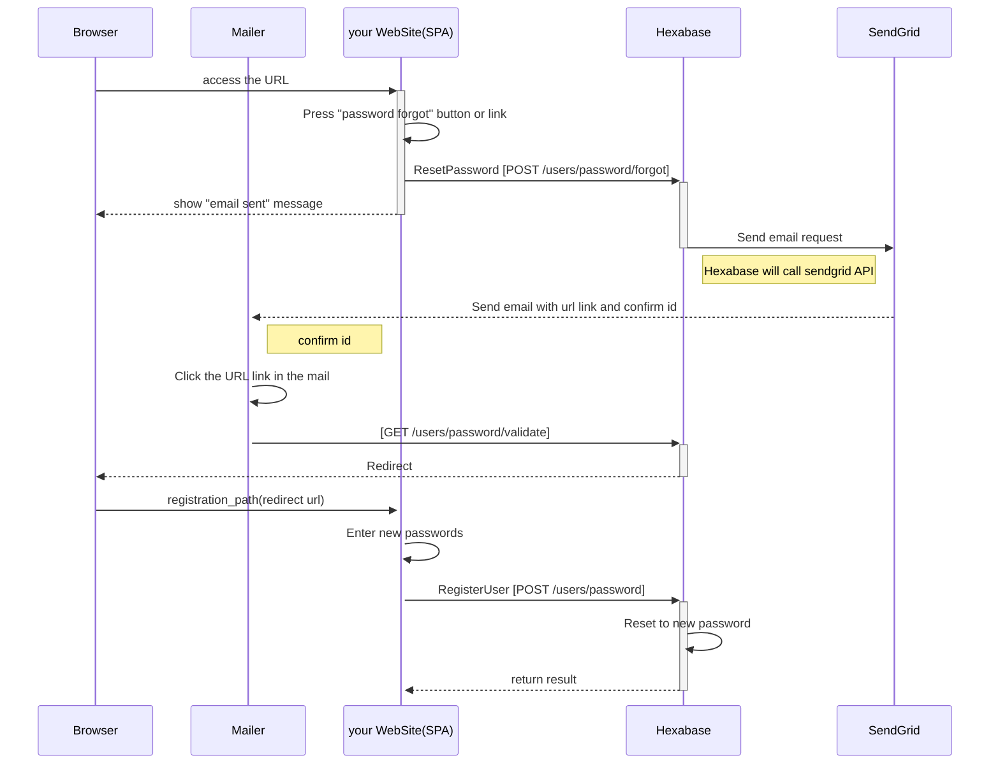
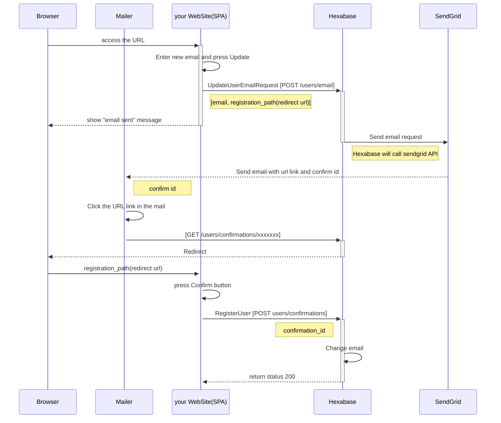

ログインユーザの情報取得や更新に関連するAPI

## Overview

ログイン済ユーザ情報の検索、更新などのフローと利用APIを説明します。
メールを送信するため、SendGridサービスを利用します。

## Pre Requisites

ログイン可能なHexabaseアカウントがすでに存在すること

## API

### ログインユーザー情報

ログインしているユーザーに関する情報を取得します。

| No | API Name | API名 | Method | URI | 目的 | version | 画面ID\(display\_id\)への対応 |
| :---: | :--- | :--- | :--- | :--- | :--- | :--- | :--- |
| 43 | [GetUserInfo](GetUserInfo.md) | ユーザー情報取得 | GET | /api/v0/userinfo | ユーザーの関連情報取得 | v0 | - |
| 61 | [UpdateUserInfo](UpdateUserInfo.md) | ユーザー情報更新 | PUT | /api/v0/userinfo | ユーザー名、情報の更新 | v0 | - |

### パスワード変更

パスワードを忘れたユーザ向けに、パスワードを再発行します

| No | API Name | API名 | Method | URI | 目的 | version | 画面ID\(display\_id\)への対応 |
| :---: | :--- | :--- | :--- | :--- | :--- | :--- | :--- |
| 56 | [ResetPassword](ResetPassword.md) | パスワード初期化リクエスト | POST | /api/v0/users/password/forgot | ログイン前、パスワード初期化 開始 | v0 | - |
| 57 | [SetNewPassword](SetNewPassword.md) | パスワード再登録 | PUT | /api/v0/users/password/forgot | ログイン前、パスワード初期化 パスワードを変更 | v0 | - |
| 58 | [ValidatePassword](ValidatePassword.md) | パスワード変更確認 | GET | /api/v0/users/password/validate | ログイン前、パスワード初期化　パスワー変更状態の確認 | v0 | - |
| 59 | [SetPassword](SetPassword.md) | パスワード変更登録 | PUT | /api/v0/users/password | ログイン後、パスワード変更 | v0 | - |

#### Sequence Diagram

<!-- シーケンス図を参照するためには、Webブラウザへ[Mermaid Extension](https://chrome.google.com/webstore/detail/github-%2B-mermaid/goiiopgdnkogdbjmncgedmgpoajilohe/related) をインストールしてください -->

### メールアドレス変更

登録したユーザーのメールアドレスを変更します

| No | API Name | API名 | Method | URI | 目的 | version | 画面ID\(display\_id\)への対応 |
| :---: | :--- | :--- | :--- | :--- | :--- | :--- | :--- |
| 72 | [UpdateUserEmailRequest](UpdateUserEmailRequest.md) | メールアドレス変更リクエスト | POST | /api/v0/users/email | メールアドレス変更リクエスト | v0 | - |
| 73 | [ConfirmUserEmail](ConfirmUserEmail.md) | メールアドレス変更確認 | GET | /api/v0/users/confirmations/:confirmation_id | メールアドレス変更確認 | v0 | - |
| 74 | [UpdateUserEmail](UpdateUserEmail.md) | メールアドレス変更 | POST | /api/v0/users/confirmations | メールアドレスの変更を確定 | v0 | - |

#### Sequence Diagram

